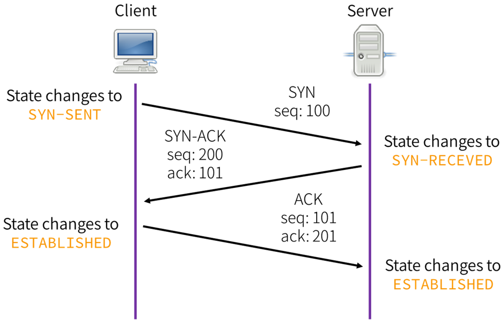
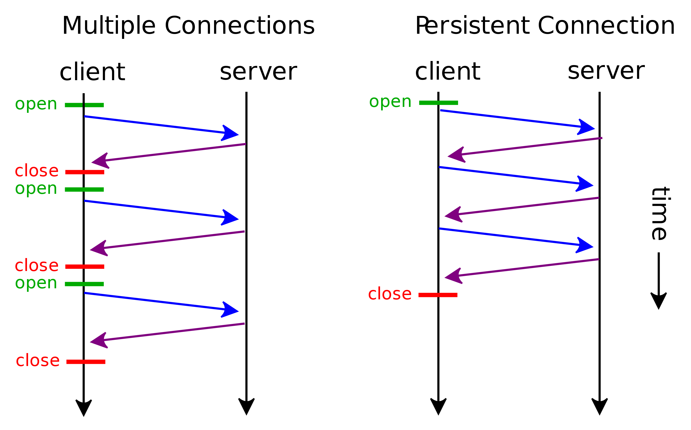
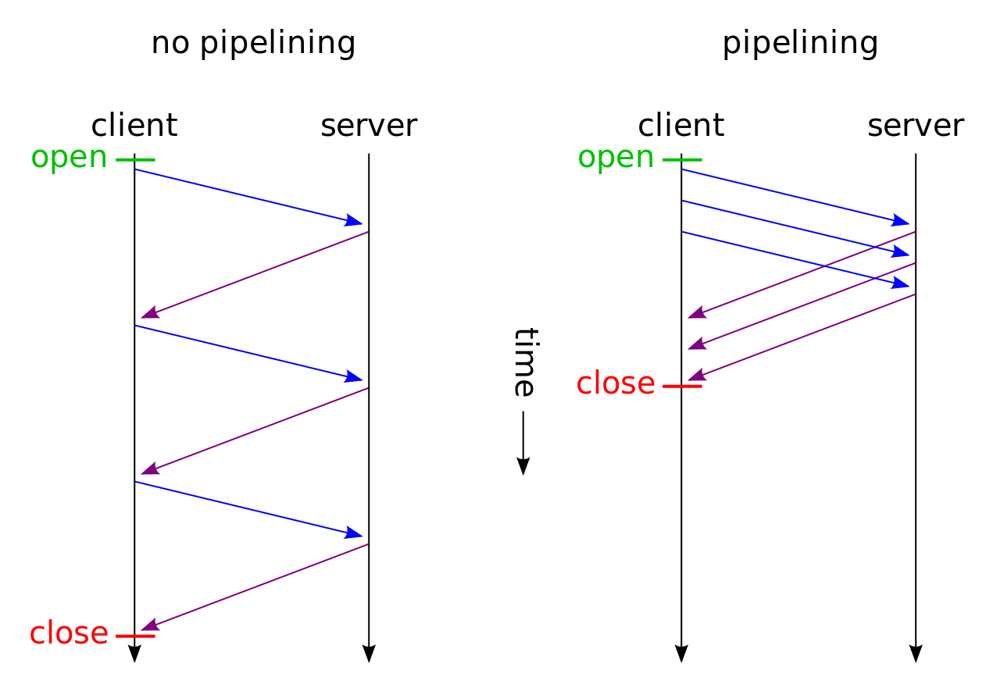

# 2장 웹 최적화

- 웹사이트는 검색 엔진 최적화(Search Engine Optimization, SEO)를 실행하면 빠르게 검색된다.
- SEO가 적용된 웹 사이트는 다른 사이트에 비해 상단 노출 회수가 높으며 많은 방문자를 이끌어낼 수 있다.

## 2.1 웹 최적화란

웹 최적화란 최고의 성능을 만드는 최적화 조건을 갖추는 것이며 다음과 같은 세가지 방법이 있다.

### 2.1.1 프론트엔드 최적화

- 웹 UI/UX와 관련된 최적화다.
- HTML, JavaScrip, CSS, Image file, 타사 파일 자체의 모음들이 콘텐츠를 만들어낼 때 최적화를 진행한다.
- 최적화가 잘 된 사이트는 브라우저에서 콘텐츠를 다운로드, 로딩, 렌더링할 때 속도가 빠르다.
- 프론트엔드 최적화 기술은 사용자 환경에 따라 달라진다. 따라서 상대적으로 적용해야 한다.

프론트엔드를 최적화하는 대표적 기술은 다음과 같다.

- 스크립트를 병합(merge)하여 브라우저의 호출 개수를 줄임
- 스크립트 크기를 최소화해 바이트(byte) 자체를 줄임
- 스크립트를 gzip 등으로 압축하여 전달
- WebP 등으로 브라우저 이미지 형식을 최적화
- 이미지 손실, 무손실 압축
- Cache-Control 응답 헤더를 통해 브라우저 캐시를 충실히 사용
- 도메인 수를 줄여 DNS 조회를 최소화
- DNS 정보 미리 읽어 오기
- CSS를 HTML 상단에, 자바스크립트를 HTML의 하단에 위치시키기
- 페이지 미리 읽어 오기(page prefetching)
- 타사 스크립트가 웹 성능을 방해하지 않도록 조정한다.

### 2.1.2 백엔드 최적화

- 백엔드 관련 최적화란 웹 UI를 로직에 맞게 만드는 것이다.
- 웹 서버, 웹 애플리케이션 서버, 데이터베이스, 로드 밸런싱, DNS 서버 등이 해당된다.
- 프론트에 비해 가시적 효과가 크지 않지만 웹사이트의 빠른 로딩보다 네트워크를 정상적으로 사용하고 콘텐츠를 전달하기 위해 반드시 필요한 요소다.

백엔드를 최적화하는 대표적 기술은 다음과 같다.

- DNS 응답이 빨라지도록 서버 증설
- DNS 응답을 빠르게 할 수 있도록 DNS 정보를 최대한 캐싱
- 웹 서버가 있는 데이터 센터의 네트워크 출력(throughput)/대역폭(bandwidth) 증설
- 웹 서버, 웹 애플리케이션 서버의 CPU/RAM 증설
- 프록시 서버를 설정하여 웹 콘텐츠를 캐싱
- CDN(Content Delivery Network)을 사용해 인터넷상에 콘텐츠 캐싱
- 데이터베이스 정규화로 디스크 I/O 최적화
- 데이터베이스 캐싱으로 응답을 빠르게
- 로드 밸런싱을 통해 가장 성능이 좋은 웹 서버로 요청을 연결
- 웹 애플리케이션 로직을 가볍고 빠르게 개발

### 2.1.3 프로토콜 최적화

- 웹 콘텐츠를 전달하는 HTTP/HTTPS 프로토콜 자체의 효과를 극대화하면 웹 서버가 클라이언트에게 콘텐츠를 최대 속도와 최저 지연 시간으로 전달할 수 있다.
- 프로토콜 최적화란 웹 콘텐츠를 더 빠르게 요청하고 응답하도록 프로토콜을 업그레이드하는 과정이다.

<br>

## 2.2 TCP/IP 프로토콜

웹은 TCP/IP 프로토콜(4, 전송)의 일종인 HTTP(7, 응용)를 사용해 콘텐츠를 전달한다.

- 전송 계층은 네트워크상에서 송신자와 수신자 사이에 데이터 전송을 보장하는 역할을 한다.
- 응용 계층은 메일, FTP, 인터넷 등 실제 네트워크상에서 SW와 사용자의 상호 연동을 담당한다.
- 전송과 응용 계층은 독립적인 것이 아니라 상위 계층인 응용 계층이 하위 계층인 전송 계층을 바탕으로 운용되는 구조다.

TCP 네트워크를 사용하는 네트워크에 있어 대표적인 성능 지표는 대역폭, 지연 시간이다.

- 대역폭: 특정 시간동안 얼마나 많은 네트워크 트래픽을 보낼 수 있는지. 시간당 전송량이다.
- 지연 시간: 클라이언트와 서버 사이의 요청 + 전달 + 응답시간을 의미한다.
- 크기가 큰 이미지 파일을 다운로드하려면 완료시간은 클라이언트와 서버 사이 대역폭에 영향을 받는다.
- 가변 스트리밍 방식이란 지연 시간이 길고 짧음에 따라 전달받는 영상의 품질을 조절해 버퍼링을 줄이는 방식이다.

TCP는 웹 성능과 밀접한 관련이 있다. 다음은 성능 저하 요소를 해결하는 TCP 기술들에 대한 설명이다.

### 2.2.1 TCP 혼잡 제어

- TCP 혼잡 제어(congestion control)는 TCP 네트워크의 통신량을 조절하여 TCP 네트워크가 혼잡해지지 않도록 하는 방식이다.
- TCP 혼잡 붕괴(congestion collapse)는 TCP 네트워크의 통신량이 실제 처리량보다 많아서 문제가 발생하는 것이다.
- 혼잡 붕괴는 인터넷에 연결된 호스트들이 최대한 많은 정보를 전송하려고 많은 네트워크 패킷을 보내기 때문에 발생한다.
- TCP 혼잡 제어 기술
  - 패킷을 보내는 쪽에서 네트워크에서 수용할 수 있는 양을 파악해 그만큼의 패킷만 보내는 약속으로 해결한다.
  - 받는 쪽은 패킷이 정상적으로 송신되었음을 알리는 ACK 패킷을 보낸다. ACK 패킷을 받은 호스트는 지속적으로 패킷을 보낼 수 있다.
  - 호스트가 네트워크의 상태를 파악하고 전송 속도를 조절하는 것 또한 혼잡 제어 기능 중 하나다.

다음은 혼잡 제어의 대표적 기술들이다.

#### 느린 시작

- TCP 연결이 시작되면 전송 가능한 버퍼의 양인 혼잡 윈도우(CWND)의 값을 작게 설정해 전송한다.
- 패킷이 정상적으로 도착할 때마다 많은 패킷을 보내고 이를 패킷 유실이 발생하기 전까지 반복하는 방식이다.
- 호스트가 ACK 응답을 받지 못하면 혼잡 윈도우의 크기는 줄어들지 않는다.
- 따라서 웹 사이트에 접속한 브라우저는 처음부터 많은 패킷을 보내지 않는다.

#### 빠른 재전송(fast retransmit)

- 먼저 도착해야하는 패킷이 도착하지 않고 다음 패킷이 도착한 경우에도 수신자가 일단 ACK패킷을 보내는 방식이다.
- 중간에 패킷이 하나 손실되면 송신자는 중복된 ACK 패킷을 통해 이를 감지하고 정상적인 패킷을 재전송한다.

#### 흐름 제어

- TCP 송신자가 데이터를 너무 빠르게 혹은 너무 많이 전송하여 수신자의 버퍼가 오버플로되는 현상을 방지하는 방식이다.
- 트래픽 수신 속도를 송신 속도와 일치시키는 기술이다.

<br>

## 2.3 HTTP 프로토콜

### 2.3.1 HTTP 최적화 기술

- HTTP/0.9: 클라이언트와 서버의 인터넷 통신 정상화, 가용성 신뢰성, 기능에 초점을 두었다.
- HTTP/1.0: 클라이언트와 서버 사이에 응답을 빠르게 하기 위한 연구가 진행되었다.
- HTTP/1.1: TCP/IP 연결을 재사용 하는 기능이 추가되었다.

HTTP 최적화 기술은 연결 재사용, 파이프라이닝 기법을 사용하는 것이다.

### 2.3.2 HTTP 지속적 연결

TCP 통신을 연결하는 3-way handshake 방식은 다음과 같이 이루어진다.



- SYN(synchronize sequence numbers), ACK(acknowledgment)을 이용한 3번의 요청으로 신뢰할 수 있는 통신을 추구하는 방식이다.
- 5개의 오브젝트를 가진 웹 페이지에 연결하려면 클라이언트와 서버가 5번의 3-way sh 과정을 통해 TCP 연결을 맺어야 한다.

HTTP 지속적 연결은 TCP 연결 재사용이 가능하다.



- TCP 상에서 한 번 연결되면 완전히 연결이 끊어지기 전까지 지속적으로 재사용 할 수 있다.
- HTTP/1.0에서 Connection 헤더 및 keep-alive 속성으로 지속적 연결을 요청하기 시작했다.
- HTTP/1.1에서는 기본으로 지원하며 TCP 연결을 끊어야할 때만 Connection 헤더를 사용한다.
  - `Connection: close`
- HTTP/2.0에서는 스트림 형태로 다수의 요청과 응답을 주고 받을 수 있는 멀티플렉싱 기술의 토대를 만들었다. 따라서 지속적 연결에 대해 고민할 필요가 없다.
- 메인 페이지와 같이 많은 클라이언트가 접속하는 페이지는 서버의 성능을 고려해 지속적 연결 기능을 사용할지 결정해야 한다.

복수의 HTTP 요청과 응답을 병렬로 동시에 처리하기 위한 HTTP 파이프라이닝 기술을 사용하려면 지속적 연결 기능이 꼭 지원되어야 한다.

### HTTP 파이프라이닝



- 먼저 보낸 요청의 응답이 없어도 다음을 병렬적으로 수신자 측에 전송하는 기술이다.
- 중간에서 응답 지연이 발생하더라도 클라이언트는 먼저 서버 측의 응답을 받을 수 있다.

<br>

## 2.4 DNS

DNS(Domain Name System)는 호스트명을 IP 주소로 변환해주는 시스템이다.

### 2.4.1 DNS의 작동 원리

DNS 질의 응답 속도는 웹 사이트 로딩에 영향을 줄 수 있다.


1. 로컬 DNS 서버로 질의

   - 로컬 DNS에게 "www.naver.com"이라는 호스트명에 대한 IP 주소를 질의한다.
   - 로컬 DNS에 캐시된 값이 있으면 IP 주소를 반환한다.
   - 그렇지 않으면 루트 DNS로 질의한다.

2. 루트 DNS 서버로 질의

   - 전체 도메인을 관장하고 있는 루트 DNS는 가지고 있는 .com 도메인 서버의 IP 정보를 알려준다.

3. .com DNS 서버로 질의

   - 로컬 DNS는 .com DNS에 도메인을 질의한다.
   - .com DNS는 자신이 알고 있는 naver.com 네임 서버의 IP 주소를 알려준다.

4. example.com DNS 서버로 질의

   - 로컬 DNS는 naver.com DNS에 도메인을 질의한다.
   - naver.com DNS는 자신이 알고있는 www.naver.com 네임 서버의 IP 정보를 알려준다.

5. Local DNS는 www.naver.com IP 주소를 캐싱하고 IP 주소 정보를 전달한다.

로컬 DNS 서버는 업체가 관리하며 루트 DNS는 ICANN 기관에서 관리한다.

따라서 웹 서비스 운영 업체는 전문 업체의 서비스를 받거나 분산된 DNS 서버를 직접 운영 하는 방식으로 성능을 향상시킬 수 있다.

### 2.4.2 사용 중인 다양한 도메인 확인 방법

- 타사 서비스는 업체가 관리하므로 삽입된 타사 서비스 도메인 조회로 인해 로딩에 문제가 발생할 수 있다.
- 사용 중인 특정 모듈 서비스 업체의 DNS 조회가 불가능하거나 느리다면 해당 모듈을 다운로드해 자신의 웹 서버에 설치하여 사용하는 방법 등도 고려해야 한다.

### 2.4.3 웹 성능을 최적화하는 도메인 운용 방법

- 직접 개발한 내부 서비스의 도메인 분할을 하고 싶다면 TLD를 동일하게 해 DNS 질의를 최대한 적게 만들어야 한다.
- 이는 캐싱된 정보를 재사용할 수 있으며 인증서(SSL) 발급 비용과 수고를 줄일 수 있다.
- HTML DNS 프리페치 기능은 페이지를 여는 시점에 멀티스레드 방식으로 미리 DNS를 조회해 빠르게 불러오는 기술이다.
  - `<link rel="dns-prefetch" href="//example.com">`
  - 브라웢는 웹 콘텐츠를 다운로드함과 동시에 DNS를 조회해 성능이 더 빨라진다.

<br>

## 2.5 브라우저

### 2.5.1 브라우저의 역사와 특징

- 넷스케이프: http:// 주소에서 접속할 웹 서버의 IP 주소를 찾고 HTTP로 웹 콘텐츠를 가져오는 기능을 수행한다.
- IE3: CSS와 오디오 파일 재생 기능을 추가했다.
- 이후 멀티미디어 요소가 늘어나면서 쉽게 웹 페이지에 추가하기 위한 HTML5와 CSS3가 개발되었다.

HTTP가 웹 콘텐츠를 빠르게 전달해도 브라우저가 빠르게 작동하지 않으면 성능은 느려진다.

### 2.5.2 내비게이션 타이밍 API

- 웹 사이트의 성능을 측정하는데 사용할 수 있는 데이터를 제공한다.
- 이전까지는 자바스크립트를 이용해 페이지 열리는 시간과 로딩 완료 시간을 계산해 로딩 시간을 구했다.
  - 최상/하단에 `Date.now()`를 통해 측정
- 내비게이션 타이밍 API는 종단과 대기 시간을 제공하며 window.performance 객체의 프로퍼티로 사용할 수 있다.

### 2.5.3 내비게이션 타이밍 속성


- 책 55페이지
- [참고](https://inswave.com/confluence/pages/viewpage.action?pageId=12386335)

### 2.5.4 내비게이션 타이밍 속성값 구하기

- window.performance.navigation 객체는 페이지 재전송, 앞뒤 이동 버튼이나 URL이 어떤 페이지 로딩을 트리거하는지 확인하는 속성을 저장한다.
  - redirectCount: 재전송이 몇번 발생했는가
  - type: 웹 페이지에 어떻게 접속했는가
    - NAVIGATE(0): 링크, 폼 전송, 브라우저 URL 타이핑 등
    - RELOAD(1): 새로고침
    - BACK_FORWARD(2): 뒤로가기
    - RESERVED(255): 그외 방법

#### 예제

```html
<!-- 사용자가 느끼는 페이지 로딩시간 구하기 -->
<script>
  function onLoad() {
    const now = new Date().getTime();
    const page_load_time = now - performance.timing.navigationStart;

    console.log(page_load_time);
  }
</script>

...

<body>
  <script>
    onLoad();
  </script>
</body>
```

```js
// 페이지 로딩 시간 구하기

const perfData = window.performance.timing;
const pageLoadTime = perfData.loadEventEnd - perfData.navigationStart;

// pageLoadTime이 크면 웹 콘텐츠 수나 크기를 줄여 로딩을 빠르게 해야 한다.
```

```js
// 연결 시간 구하기

const connectTime = perfData.responseEnd - perfData.requestStart;

// connectTime이 크면 빠르게 네트워크에 연결하기 위한 방법을 찾아야 한다.
```
