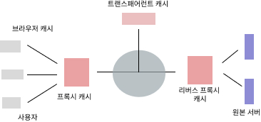

# 6장 캐시 최적화

## 6.1 캐시

캐시 서버는 프록시, ISP 라우터 등 다양한 위치에 존재한다.

### 브라우저 캐시

- 브라우저에 위치한다.
- 한 번 다운로드한 리소스들을 재사용해 로딩을 빠르게 한다.

### 프록시 캐시

- 브라우저와 ISP에 위치한다.
- 리소스들을 캐시해 네트워크 연결과 대욕폭 사용률을 감소시킨다.

### 트랜스패어런트 캐시

- ISP에 위치한다.
- ISP간 대역폭이 낭비되는 것을 막는다.

트랜스패어런트 캐시는 다음과 같은 방식을 대역폭 사용량을 절약한다.

1. 소프트웨어 업데이트를 100대의 컴퓨터에 모두 다운로드할 경우 한 대의 컴퓨터에 다운로드 받은 요청 내용을 캐시해 트랜스패어런트 프록시 서버에 저장한다.
2. 캐시된 후 다른 컴퓨터가 동일한 소프트웨어를 요청하는 경우 트랜스패어런트 프록시 서버에서 곧바로 전송한다.

#### 트랜스패어런트 프록시

- 웹 서버로 요청 메시지가 흘러가는 길에 위치한다.
- 메시지가 트랜스페어런트 프록시를 통과할 때 그것을 가로채 특정한 동작을 수행한다.

트랜스패어런트 프록시는 다음과 같은 목적을 위해 사용된다.

1. 검열 및 모니터링의 편리성
   - 큰 기관이나 조직에서 필터링을 통해 사이트 접속 시간, 근무 시간, 제한된 콘텐츠 액세스 시도 등을 확인할 수 있다.
   - 공용 WiFi를 제공하는 일부 회사에서도 투명 프록시를 사용하여 사용자를 인증합니다.
2. 사용자 인증
   - 접속 요청 트래픽을 먼저 로그인 페이지로 이동시키고 이용약관에 동의 후 인터넷을 사용하게 하는 것이 투명 프록시를 사용하고 있는 경우이다.
   - 카페에서 접속자를 카페 방문객으로 확인하고 사용자가 방문하는 웹 사이트과 컨텐츠를 자체 네트워크에서 추적 할 수 있다.

큰 회사에서 별도의 데이터를 저장하거나 내부 네트워크 사용을 모니터링해야 하는 경우 혹은 민감한 콘텐츠로부터 자녀를 보호해야하는 경우가 아니면 일반적인 개인 컴퓨터나 가정에서는 트랜스패어런트 프록시 서버가 필요하지 않다.

[출처](https://blog.daum.net/nordvpn.kr/23)

### 리버스 프록시 캐시

- ISP와 웹서버에 위치한다.
- 원본 서버로 향하는 트래픽 대역폭을 감소시키고 사용자 응답을 개선한다.

#### 포워드 프록시와 리버스 프록시

- 포워드 프록시
  - 클라이언트 -> **포워드 프록시** -> 인터넷 -> 서버
  - 클라이언트는 서버를 알지만, 서버는 프록시를 통해 요청이 오기 때문에 클라이언트를 알지 못한다.
- 리버스 프록시
  - 클라이언트 -> 인터넷 -> **리버스 프록시** -> 서버
  - 서버는 클라이언트를 알지만, 클라이언트는 프록시를 통해 서버에 접근하기 때문에 서버를 알지 못한다.

 

## 6.2 웹 캐시 동작 원리

- 웹 캐시는 웹 서버와 웹 브라우저 중간에 존재한다.
- 최초 원본 콘텐츠 요청을 최종 서버에 보내 응답을 받은 후 그 복사본을 만들어 저장하고 사용자에게 응답한다.
- 이후 같은 콘텐츠에 대한 요청이 오면 최종 서버에서 원본 서버를 가져오는 대신 복사본을 사용자에게 응답한다.
- 캐시에 저장된 콘텐츠가 변경되면 캐시는 이를 감지해 다시 원본 서버에 원본 콘텐츠를 요청해야 한다.

### 6.2.2 HTTP의 캐시 제어 방식

- HTTP/1.1부터 명시적으로 캐시를 제어할 수 있는 Cache-Control가 추가되었다.
- 캐시를 제어하는 목적은 크게 다음과 같다.
  - 원본 서버로의 요청수 최소화 -> 네트워크 왕복수를 줄여 응답 속도 단축
  - 완전한 콘텐츠를 응답할 필요가 없다. -> 대역폭/리소스 등 비용 절약

캐시를 제어하는 HTTP 헤더는 다음과 같다.

- **Expires(HTTP/1.0)**
  - 원본 서버 콘텐츠 유효기간을 저장한다.
  - 명시적인 제어가 아닌 서버에서 콘텐츠를 언제까지 저장할 것인가 판단하기 위해 사용한다.
- **Cache-Control: max-age**
  - 콘텐츠의 캐시 유지 시간을 정의한다.
  - 이 기간이 지나면 서버에 콘텐츠 변경 여부를 체크하거나 새로 갱신해야 한다.
  - Expires와 Cache-Control: max-age가 동시에 명시된 경우 Cache-Control 헤더를 우선 사용한다.
- **Cache-Control: s-maxage**
  - CDN과 같은 공용 캐시 주기를 관리한다.
- **Etag**
  - 원본 서버가 리소스를 식별하기 위해 부여하는 고유 번호다.
  - 이를 사용해 원본 서버의 리소스의 만료 여부와 캐시된 리소스의 갱신 여부를 판단한다.
  - 같은 주소의 리소스더라도 콘텐츠가 달라졌다면 ETag가 다르다.
- **Cache-Control: public | private**
  - public은 모든 캐시 서버에 캐시될 수 있음을 의미한다.
  - private로 설정하면 용청한 사용자만 캐시할 수 있고 범용 캐시 서버(CDN)에는 캐시할 수 없다.
- **Cache-Control: no-cache**
  - 캐시 서버는 항상 원본 서버로부터 최신 응답을 받아와야 한다.
- **Cache-Control: no-store**
  - 응답 메시지가 저장소에 저장되는 것 자체를 금지한다.

 

## 6.2.3/6.2.4 캐시 유효성 체크 / 캐시 콘텐츠 갱신

- 시간 기반의 조건부 요청
  - 콘텐츠의 최종 변경 시간 중심으로 콘텐츠의 변경 여부를 확인한다.
  - 요청에 대한 Cache-Control, Last-Modified 응답을 저장해 확인하고 If-Modified-Since 헤더를 원본 서버에 전송해 수행한다.
- 콘텐트 기반 조건부 요청
  - 콘텐츠 고유값을 중심으로 콘텐츠의 변경 여부를 확인한다.
  - 서버는 현재 버전의 Etag 값과 요청 헤더의 Etag 값을 비교해 요청을 수행한다.
- 퍼지
  - 저장소를 완전히 지우는 방식의 명령어와 API를 제공한다.
  - 단계적 퍼지나 무효화를 사용하는 것이 권장된다.
- 무효화(invalidate)
  - 조건부 요청을 통해 캐시된 리소스들 중 변경이 있었던 리소스들만 새로 갱신하는 방법이다.

 

## 6.3 캐시 최적화 방안

- 캐시 효율화를 위한 3원칙 즉, 캐시 사용을 최대화할 수 있는 3가지 기본 원리는 다음과 같다.
  1. 최대한 많이 캐시하라
  2. 최대한 오래 캐시하라
  3. 최대한 가까이 캐시하라

### 6.3.1 캐시 가능한 콘텐츠 구분하기

- 캐시하기 어려운 콘텐츠는 다음과 같이 분류할 수 있다.

#### 개인화된 콘텐츠

- 접속하는 사용자에 따라 달라지는 콘텐츠다.

#### API 호출이나 Ajax 요청에 대한 콘텐츠

- 사용자의 동적 정보를 원본 서버에 전달해 결과 값을 받는 콘텐츠다.
- 인증이나 결제, 시간에 따라 변하는 정보를 받는 콘텐츠는 캐시에 적합하지 않다.
- 제품을 조회하는 등 입력 값이 동일하다면 캐시가 가능하다.

#### Beacon 전달 또는 쿠키 설정을 위한 호출

- 사용자 정보를 수집하거나 쿠키를 설정하기 위해 작은 이미지를 호출하는 경우, 응답이 캐시되면 원 서버에 정보를 보낼 수 없음으로 캐시하면 안된다.

### 6.3.2 올바른 캐시 정책 설정하기

- 캐시 정책을 세우는 것은 캐시할 콘텐츠들의 성격을 파악하고 그룹화하는 것이다.
- 다음과 같은 순서를 참고해 그룹을 나누기 정책을 결정한다.

#### 1. 먼저 캐시할 수 있는 콘텐츠인지 판단한다.

- 정적 데이터라고 하더라도 보안에 민감한 정보를 가진 데이터는 캐시하면 안된다.
- 캐시할 수 없는 콘텐츠를 파악해 Cache-Control: no-store를 붙여 캐시되지 않도록 설정한다.

#### 2. 캐시할 수 있는 콘텐츠들은 매번 원본 서버에 변경 사항을 확인해야 하는지 판단한다.

- 변경에 민감한 리소스는 응답 헤더에 Cache-control: no-cache 또는 max-age=0을 사용해 설정한다.
  - no-store는 항상 전체 콘텐츠를 받으므로 이보다 대역폭 낭비를 줄일 수 있다.
- 리소스가 변경되지 않았으면 전체 리소스가 아닌 304코드로 응답하면 되므로 대역폭 낭비를 방지한다.

#### 3. 캐시할 콘텐츠들의 성격을 판단한다.

- 공통으로 사용될 수 있다면 Cache-Control: public을 사용한다.
- 개인화된 콘텐츠라면 Cache-Control: private를 사용한다.
  - private는 개인 브라우저에서만 캐시한다.

#### 4. 캐시 주기를 설정하고 max-age를 추가한다.

### 6.3.3 캐시 주기 결정하기

- 캐시 정책이 결정되면 캐시 주기를 결정해야 한다.
- 캐시 주기는 다음 내용을 고려해 결정할 수 있다.

#### 캐시 주기는 콘텐츠 타입별로 다르게 설정할 수 있다.

- 미디어 파일은 한번 게시되면 쉽게 변경되지 않고 수정시 파일명과 링크가 변경되는 경우가 많다.
- 링크 자체가 바뀌면 새롭게 불러오므로 캐시에 대한 추가 조치가 필요하지 않다.
- 따라서 특별한 이유가 없다면 캐시 주기르 1년 정도 길게 설정하는 것이 권장된다.

#### 만약 링크 변경 없이 이미지 내용만 바꿔야 한다면 무효화 방식으로 해당 이미지만 캐시에 업데이트 한다.

- CSS, JS, 폰트 등의 리소스 파일은 변경이 얼마나 자주 일어나는지를 고려해 가능한 길게 설정한다.
- 폰트는 업데이트 횟수가 드물기 때문에 길게 설정하는 것이 권장된다.
- 스타일시트, 스크립트는 업데이트가 자주 발생하므로 짧게 설정한다.
- 변경 주기가 잦더라도 캐시를 하지 않는 것보다 짧게 캐시하는 것이 성능에 유리하다.

#### 모든 정적 파일에 대해 캐시 주기를 길게 설정하고 수동으로 캐시 주기를 관리하는 방법도 있다.

- 수동으로 캐시 주기를 관리하는 방법은 다음과 같다.
  - 파일명 뒤에 해시값을 자동으로 붙여 파일명을 변경: `index.60c4c63d.js`
  - 파일 요청시 쿼리 스트링으로 버전을 지정: `core.min.js?201707311505`

### 6.3.4 캐시에 적합한 디렉터리 구조 구성하기

- 캐시 친화적 디렉터리 구조를 구성하는 것이 권장된다.
  1. 캐시할 수 있는 콘텐츠들을 별도의 폴더에 분류해 관리한다.
  2. 캐시 주기별로 나누어 구성한다.
  3. 동일한 파일을 여러 곳에 분산시키지 않아야한다.
     - 상대 경로를 사용하려고 같은 파일을 여러 폴더에 복제하여 사용 경우, 캐시 서버는 URL을 키 값으로 하여 동작하므로 다수의 복사본이 생성된다.

### 6.3.5 캐시 키 올바르게 사용하기

- 웹 캐시는 클라이언트가 요청하는 URL을 캐시 키로 사용한다.
- 캐시 충돌 : 요청 URL이 하나인데 브라우저 환경에 따라 서버에서 제공하는 응답이 달라져 결국 최초 요청한 브라우저의 응답만 캐시되는 것을 의미한다.

#### 캐시 오염

- 원본 서버에 하나의 원본 파일만 존재하는데 캐시에 복사본이 여러 개 존재하는 것을 말한다.
- 캐시 오염은 최종 사용자에게 영향을 주지는 않지만 캐시 서버의 효율성에 큰 영향을 미칠 수 있다.
- 캐시가 퍼지된 경우 원본 서버에 예기치 않은 트래픽 부담을 줄 수 있다.

캐시 오염을 피하는 방법은 다음과 같다.

1. URL에 붙은 특정 쿼리 스트링 값이 달라지더라도 응답이 항상 같다면 캐시 키에서 쿼리 스트링을 무시하도록 설정해야한다.
2. 쿼리 스트링의 순서를 동일하게 정렬한다.
   - 쿼리 스트링 순서가 달라져도 캐시는 이들을 다르게 인식한다.
   - 쿼리 스트링을 사용할 때는 오름차순이나 내림차순으로 항상 동일하게 순서를 정렬해 호출하도록 설정해야한다.
3. Vary 헤더를 바르게 사용해야 한다.
   - Vary 헤더는 동일한 URL에 대해 요청을 하더라도 요청한 사용자의 특징(User Agent, Accept Encoding, Origin 등등)에 따라 서로 다른 응답을 해 주기 위해서 존재하는 헤더다.
   - Vary 헤더가 잘못 사용되었을 때 캐시는 같은 페이지의 복사본을 여러 가지 캐시 키로 다르게 저장하기도 한다.
   - 꼭 필요한 경우가 아니면 Vary 헤더를 사용하지 않거나 Cache-Control: private을 사용해 중간 캐시 서버에는 캐시하지 않도록 하는 것을 추천한다.

#### 캐시 충돌 방지

- 동적 페이지를 캐시할 때 특별한 캐시 설정을 하지 않으면 캐시 충돌이 현상이 발생한다.
  - 첫 사용자가 로그인 전 화면을 캐시하면 이후 사용자는 로그인 여부와 상관 없이 같은 화면을 보게 된다.
- 기본적으로 동적 페이지는 캐시를 하지 않아야 한다.
- 일부 동적 페이지에 캐시를 사용하고자 한다면 Cache-Control: private으로 사용자 브라우저에만 캐시하여 페이지 로딩 시간을 단축할 수 있다.

### 6.3.6 CDN 사용하기

> CDN은 7장에서 자세히 나올 예정이다.

- 사용자가 관련 콘텐츠를 요청할 때 사용자와 가장 가까운 캐시 서버에서 해당 콘텐츠가 서비스되므로 시간 지연 없이 빠르게 웹 페이지를 로딩할 수 있다.

 

## 6.4 동적 콘텐츠 캐시

- 전체 응답 시간 중 많은 부분을 차지하는 것은 동적 콘텐츠를 처리하는 시간이다.
- 이를 캐시할 수 있다면 체감하는 응답 시간을 단축시키고 서버의 리소스도 절약할 수 있다.
- 웹 콘텐츠는 다음과 같이 분류할 수 있다.
  - 정적/동적 콘텐츠
  - 익명 콘텐츠: 누구에게나 드러나는 콘텐츠다.
  - 개인화 콘텐츠: 요청한 사용자 정보에 따라 다르게 나타나는 콘텐츠다.
  - 시간에 민감한/둔감한 콘텐츠

### 6.4.1 동적 콘텐츠 캐시

- 동적 콘텐츠를 사용자에게 전달하기 위해 원본 서버는 다음과 같은 두 가지 방법을 사용한다.
  1. 동적 정보를 쿠키에 넣어 보낸다.
     - 요청 쿠키, 헤더 혹은 쿼리 스트링에 동적 콘텐츠에 대한 정보가 있으면 이 정보들을 캐시 키에 추가함으로써 동적 콘텐츠를 캐시할 수 있다.
     - 사용자 로그인 페이지는 로그인 정보가 쿠키에 있는 경우와 없는 경우로 그룹화하고 쿠키가 없을 때만 캐시한다.
     - 보안, 서버 용량에 주의해야 한다.
  2. Ajax 요청으로 관련 정보를 동적으로 받아온다.
     - Ajax 요청의 응답 형태인 JSON/XML 콘텐츠는 다른 정적 응답 타입과 같은 방식으로 캐시할 수 있다.

### 6.4.2 POST 응답 캐시

- POST 메소드를 사용하면 HTTP 페이로드에 쿼리 스트링 내용을 포함해 보내므로 데이터 크기에 제한이 없다.
- 타인이 브라우저를 통해 쉽게 볼 수 없어 보안 측면에서도 상대적으로 안전한다.
- POST 메소드는 보통 브라우저 캐시나 조회 이력에 남기지 않고 캐시 서버에 캐시되어서도 안 된다.
- 입력 매개 변수가 동일할 때 서버로부터 항상 동일한 응답이 반환되고 보안 측면에서 공개되어도 안전한 내용이라면 캐시할 수 있다.
  - 단 캐시 키에 요청 매개 변수값들이 모두 포함되어야 캐시 오염/충돌 같은 오류 현상을 방지할 수 있다.

 

## 6.5 고급 캐시 전략

- 다음은 캐시 기능 이외에 캐시 성능을 더욱 향상시키는 부가 기능에 대한 내용이다.

### 6.5.1 ESI(Edge Side Include)

- 일부 부분만 따로 떼어내어 수행시킨 후 캐시된 나머지 부분과 다시 조합할 수 있다면 로딩 성능이 개선될 수 있다.
- ESI란 웹 페이지 조각을 동적으로 조합, 전달할 수 있도록 문법과 용도를 정의한 XML 기반 마크업 언어다.
- ESI를 사용하면 웹 캐시에 저장된 index.html과 별도의 login.html을 조합해 완전한 html을 제공할 수 있다.
- 각 페이지를 독립 객체로 취급해 별도의 캐시 정책을 사용할 수 있다.
- 웹 캐시가 ESI 언어를 지원해야 사용할 수 있다.
- 캐시 서버는 HTML을 먼저 가져와 ESI 부분을 수행해 완벽한 HTML을 만들어 클라이언트에 전달한다.

[참고](https://www.hahwul.com/cullinan/esii/)

### 6.5.2 HTML5 로컬 스토리지

- 쿠키는 보안에 취약하며 용량, 갯수 등의 제약이 있다.
- 웹 스토리지를 사용하면 쿠키의 단점을 보완하고 대역폭 절감과 key/value 데이터로 편리하게 사용할 수 있다.
- 폰트, CSS, JS를 저장해놓으면 재방문 시 로딩 속도를 대폭 개선할 수 있다.
