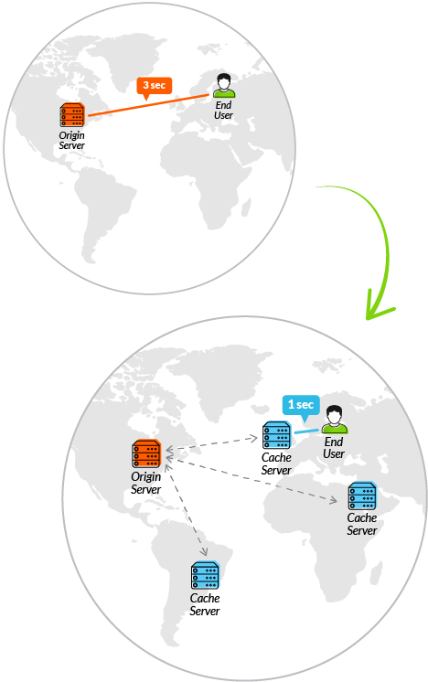

# 7장 CDN

## 7.1 CDN을 사용하는 이유

- CDN은 웹 서버를 전 세계에 분산 배치해 콘텐츠를 보다 빠르게 다운로드할 수 있도록 하는 기술이다.
- 먼 곳에 위치한 서버가 아닌 가장 가까운 캐시 서버에 접속해 원하는 콘텐츠를 다운로드할 수 있다.
- Akamai Technologies, CDNetworks, Amazon CloudFront, MS Azure, Cloudflare, Limelight Networks 등의 CDN 업체들이 있다.

### CDN 서비스의 이점

CDN 서비스는 다음과 같은 이점이 있다.

#### 1. 성능 및 안전성 보장

- CDN 서비스 업체들은 많은 수의 POP를 보유하고 있다.
  - POP(Point of Presence): 각 지역의 캐시 서버이자 데이터를 보다 안정적으로 전달하기 위한 특정 지역의 저장소다.
- POP가 많을수록 인터넷 병목 구간을 피할 수 있어 사용자에게 빠르게 전송할 수 있다.
- POP간 failover 기능을 통해 일부 POP에서 장애가 발생해도 다른 POP에서 끊김없이 서비스를 제공할 수 있다.

#### 2. 아키텍처 단순화

- CDN은 원본 어플리케이션을 재배포하는 방식이 아니므로 아키텍처를 특별히 변경하지 않아도 된다.

#### 3. 높은 비즈니스 투자 수익

- 사용한 트래픽만큼 비용을 지불하고 원가가 저렴하므로 투자대비 효율성이 높다.
- 하드웨어, 네트워크 유지 보수 비용이 필요하지 않다.

### CDN 특징

#### 동적 콘텐츠 가속

- 동적 콘텐츠 가속은 네트워크 혼잡 구간을 어떻게 회피하느냐가 중요하다.
- 많은 ISP 업체와 파트너십, 전체 네트워크 구간 모니터링을 통해 고유의 알고리즘으로 최적의 경로를 선택하는 등의 다양한 방식을 사용하고 있다.
- ADN(Application Delivery Network)
  - 망 지연이 가장 큰 구간에 위치한 서버들간에 다양한 기술들을 적용해 트래픽을 빨리 전달(가속)할 수 있도록 한다.
  - 캐싱이 불가능한 동적 콘텐츠에 네트워크 지연을 최소화할 수 있는 여러 기술을 적용해 지연을 최소화하는 기술이다.

참고: [CDN(Content Delivery Network)과 ADN(Application Delivery Network)](https://netmanias.com/ko/post/blog/5647/cdn-data-center/cdn-and-adn)

#### 프론트엔드 최적화

- 원본 서버에서 최적화를 구현하지 않아도 로딩 속도를 향상시킬 수 있다.

#### 동영상 또는 라이브 스트리밍 서비스

- CDN 제공자들은 HTTP 기반에 스트리밍 영상을 제공할 수 있는 HLS, HDS, MPEG-DASH 같은 기술 프로토콜을 지원한다.
- 사용자의 네트워크 품질에 따라 영상의 비트 전송율을 조정해 끊김없이 영상을 볼 수 있게 한다.

#### 클라우드 보안

- 대형 CDN 업체들은 디도스 방어 서비스, 웹 어플리케이션 방화벽(WAF) 서비스 등을 제공한다.

<br>

## 7.2 CDN의 원리

- CDN 업체 대부분은 사용자 스스로 CDN을 설정하고 관리하도록 권장한다.

### 7.2.1 CDN 서비스 아키텍처



- CDN은 원본 서버와 사용자들 사이의 리버스 프록시 서버 형태로 존재한다.
- 사용자와 가까운 곳에 캐시 서버들이 위치해야 하므로 사용자가 많은곳에 최대한 많은 서버를 배치한다.
- 네트워크의 끝단, 사용자와 가장 가까운 위치한 서버를 에지 서버라고 한다.
- 특정 지역에 여러개의 POP을 만들어 에지 노드를 구성한다.
- 업체마다 자체 네트워크를 구성하는 방법에 차이가 있다.
  - 주요 도시에 데이터 센터 구축,이를 중심으로 POP 구성
  - 자체적인 데이터 센터 없이 ISP나 POP 내 서버를 임대해 사용

### 7.2.2 CDN 동작 방법

- CDN을 사용하면 브라우저가 IP 주소를 조회할 때 다음과 같이 동작한다.
  1. 호스팅 조직의 DNS 서버는 자사 서버의 IP 대신 CDN 서비스 제공자의 도메인을 반환한다.
  2. 브라우저는 CDN 서비스 제공자의 DNS 서버에 대한 IP를 다시 요청한다.
  3. CDN 업체의 DNS 서버는 사용자와 가장 가까운 에지 서버의 IP를 최종 반환한다.
  4. 에지 서버는 캐시된 콘텐츠를 사용자에게 반환한다.
  5. 캐시 되어있지 않다면 원본 서버에서 콘텐츠를 받아와 캐시 후 응답한다.
- 사용자가 웹 사이트 호스팅 서버와 지리적으로 먼 경우보다 RTT가 더 적게 소요된다.

### 7.2.3 CDN 적용 방법

- 실제 CDN을 적용할 때 직접 소스 코드를 수정하는 것이 아닌 DNS를 변경함으로써 적용할 수 있다.

#### 일반적인 CDN 서비스를 사용 절차

1. 원본 서버로 사용할 호스트명과 IP를 네임 서버의 A레코드로 추가한다.
   - 새롭게 사용할 도메인인 org-www.fubar.com을 기존 도메인과 동일한 IP를 가지도록 A 레코드를 추가한다.
   - 실제로는 기존 서버명의 해시 값처럼 공격자들이 예측하기 힘든 도메인 사용이 권장된다.
   - A 레코드는 특정 도메인에 매핑하는 IP주소(IPv4)를 알려주는 레코드다.
   ```
   Authoritative Name Sever Records
   www.fubar.com       IN     A     106.10.123.12
   org-www.fubar.com   IN     A     106.10.123.12
   ```
2. CDN 설정에 원본 호스트명을 org-www.fubar.com으로 등록한다.
   - CDN 네트워크 내 에지 서버들이 원본 콘텐츠를 찾기 위해 www.fubar.com이 아닌 org-www.fubar.com으로 접속해야 한다는 것을 의미한다.
3. 기존 도메인명에 부여되어 있던 IP 정보를 CDN 서비스 제공자의 도메인 명으로 변경해야 한다.
   - CNAME 레코드는 DNS 서버에 등록된 도메인명에 다른 도메인 정보를 부여한다.
   ```
   Authoritative Name Sever Records
   www.fubar.com       IN     CNAME     www.fubar.cdn.com
   org-www.fubar.com   IN     A     106.10.123.12
   ```

참고: [DNS 레코드를 간단히 알아보아요](https://blog.o3g.org/network/dns-record/)

<br>

## 7.3 다중 캐시 전략

- CDN에 캐시한다고 해서 캐시가 100% 보장되는 것은 아니다.
- 다중 캐시란 사용자와 서버 사이에 여러 개의 캐시 계층을 주어 캐시 효율을 극대화하는 기술이다.

### 7.3.1 캐시 축출

- 캐시 축출이란 캐시 용량이 일정 한계치에 도달하면 낮은 우선순위를 갖는 캐시 콘텐츠를 삭제하는 것이다.
- 우선순위를 부여하는 정책은 공통적으로 다음과 같다.
  1. 일정 기간 캐시 적중(hit)이 없었던 콘텐츠
  2. 캐시 적중률(hit rate)이 미미한 콘텐츠
  3. 더 오래된 콘텐츠
     - 캐시 적중률이 같다면 캐시에 오래 남아있었던 콘텐츠가 삭제된다.
- 캐시 용량이 임계치에 도달하면 정해진 우선순위에 따라 낮은 순위의 콘텐츠를 삭제하고 새로운 콘텐츠를 캐시한다.

### 7.3.2 롱테일 콘텐츠


- 롱테일 콘텐츠란 생성 초기 많이 조회되다가 짧은 시간이 흐른 후 조회수가 확 줄고 거의 조회되지 않는 콘텐츠를 의미한다.

### 7.3.3 캐시 서버 간 캐시 콘텐츠 공유

- 기본적으로 사용자가 많을수록 캐시 적중률이 높아진다.
- 다른 국가의 사용자들이 서울의 특정 에지 서버에 존재하는 콘텐츠에 접근한다면 캐시 적중률은 굉장히 높아질 것이다.
- 그러나 그 콘텐츠는 실제로 다른 국가의 에지 서버들에 캐시되어 있을 것이다.
- 하나의 에지 서버를 기준으로 실제 사용자 방문의 의한 캐시 적중률은 매우 낮다.

### 7.3.4 다중 계층 캐시


- 다중 계층 캐시란 에지 서버들과 원본 서버 사이에 추가 캐시 서버를 두어 같은 콘텐츠를 여러 번 캐시하는 방식이다.
- 전 세계에 흩어져 있는 캐시 콘텐츠들을 공유하기 위해 다중 계층 캐시 전략을 사용할 수 있다.
  - 부모 계층은 원본 서버에 가깝게 존재해야 한다.
  - 부모 계층의 캐시 서버 수가 자식 계층의 서버 수보다 훨씬 적어야 한다.

다중 계층 캐시를 사용하면 다음과 같은 효과를 얻을 수 있다.

#### 캐시 적중률 향상

- 자식 계층은 부모 계층의 캐시 서버들을 사용해 콘텐츠를 공유할 수 있다.
  1. 최초 콘텐츠 요청을 받은 에지 서버가 요청을 부모로 전달한다.
  2. 부모 계층의 에지 서버가 원본 서버에서 콘텐츠를 응답 받는다.
  3. 부모 에지 서버에서 캐시한 후 자신을 호출한 자식 에지 서버에게 전달한다.
- 자식 에지 서버들은 원본 서버에 요청할 필요 없이 부모 계층에서 캐시된 콘텐츠를 받아 서비스한다.
- **부모 계층 서버들의 캐시 적중률이 높아지고, 캐시된 콘텐츠가 캐시 서버에서 축출될 확률도 낮아진다.**

#### 과도한 트래픽으로부터 원본 서버 보호

- POP 수가 많을수록 원본 서버의 트래픽은 늘어나지만 사용자에게 응답하는 속도는 빨라진다.
- 이 경우 다중 계층 캐시를 사용하면 응답 속도를 떨어뜨리지 않으면서 원본 서버로의 트래픽을 획기적으로 줄일 수 있다.

간단한 예시를 통해 원리를 이해해보자.

```
- 1000개의 요청 중 900개 요청을 캐시된 콘텐츠로 사용
  - 단위 시간당 원본 서버의 트래픽 감소율 = 900 / 1000 = 90%

이제 부모 계층에 10대의 에지 서버를 추가해보자.

- 원본 서버로 향하는 100개의 요청중 10개의 요청만 원본 서버로 향한다.
  - 단위 시간당 원본 서버의 트래픽 감소율 = 990 / 1000 = 99%
```

#### 사용자 요청에 대한 응답 속도 향상

- 캐시된 콘텐츠를 사용자에게 전달하면 빠른 응답 속도로 전달할 수 있다.
- 그러나 TTL 주기가 짧을 경우 원본 서버로의 트래픽이 많아지면서 평균 응답 속도에 영향을 미친다.
- 다중 계층 캐시를 사용하면 자식 부모 에지 서버 사이에 **전달 경로 최적화**가 적용되므로 사용자 요청에 빠르게 응답할 수 있다.

<br>

## 7.4 전달 경로 최적화

- CDN은 콘텐츠 캐시뿐만 아니라 어플리케이션 가속 서비스를 동시에 제공한다.
- 전달 경로 최적화
  - 어플리케이션 응답 속도를 빠르게하는 중요한 기능이다.
  - 동적 데이터뿐만 아니라 캐시 만료 콘텐츠를 원본에서 불러올 때도 필요한 기능이다.
  - 전달 경로를 최적화 할 때 라스트/미들/퍼스트 마일 세 구간으로 나눌 수 있다.

```
원 서버 -- (퍼스트 마일) -- 에지 서버 -- (미들 마일) -- 사용자와 가까운 에지 서버 -- (라스트 마일) -- 사용자
```

### 7.4.1 라스트 마일 최적화

- 라스트 마일 구간의 경로 최적화는 최종 사용자 요청을 사용자와 가장 가까운 곳에 있는 에지 서버로 전송하는 일이다.

CDN에서 사용하는 일반적인 가장 가까운 에지 서버 선택 방법은 다음과 같이 나눌 수 있다.

#### DNS 기반 에지 선택

```
IP 조회: 사용자 -> ISP DNS -> DNS 계층(최종 DNS 조회) -> CDN DNS 서버 -> CDN 네트워크(모니터링)
에지 IP 반환: CDN 네트워크(모니터링) -> CDN DNS 서버 -> ISP DNS 서버 -> 사용자
```

- DNS는 사용자 브라우저에서 최종적으로 에지 서버의 IP를 전달한다.
- CDN 업체들은 자사 DNS 서버로 도메인 쿼리가 요청되면 로컬 DNS와 가장 가깝고 사용량이 적은 IP를 반환한다.
  - CDN 업체는 평소 자사 에지 서버 상태와 네트워크 상황을 모니터링하고 있다.
  - DNS 쿼리에는 사용자 위치를 정확히 알아 낼 수 없다.
  - 사용자의 로컬 DNS IP 정보는 DNS 쿼리에 포함되어 사용자의 위치 정보를 짐작할 수 있다.
- 자신이 사용하지 않는 정보를 DNS 정보를 미리 지정하지 않는 한 ISP가 제공하는 DNS가 자동으로 사용된다.
- 또한 사용자와 가장 가까운 DNS 서버가 배정되도록 최적화되어 있다.
- DNS 프로토콜은 매우 기본적이고 안정적으로 사용되기 때문에 DNS 기반 에지 선택 방안도 안정적으로 운영된다.
- 사용자 위치 정보가 실사용자 아이피 정보가 아닌 ISP의 DNS 서버 위치 정보이므로 사용자가 특정 DNS 서버를 지정해 사용하는 경우 엉뚱한 곳의 에지 서버가 선택 될 수 있다.

#### 애니캐스트 기반의 에지 선택

- 우리가 접속하는 대부분의 웹 사이트는 유니캐스트 방식을 사용한다.
  - 보내는 측과 받는 측이 1:1로 통신하는 방식이다.
  - 보내는 측이 받는 측 주소를 정확하게 알아야 한다.
- 그 외에도 멀티 캐스트(1:N), 브로드 캐스트(불특정 다수에게 전송) 방식이 존재한다.


[참고](http://systemblog.kakao.com/2014/03/kakao-anycast.html)

- 애니캐스트란 네트워크상 원하는 IP 주소로 데이터를 전송하는 방식 중 하나이다.
  - 1:1 이지만 유니와 다르게 다수 노드가 같은 IP를 가진다.
  - 보내는 측이 IP 주소로 메시지를 보낼 때 네트워크상 가장 가까운 노드를 선택해 전송한다.
  - 전송될 노드가 보내는 측의 라우터와 경계 경로 프로토콜(BGP)에 의해 결정된다.
- 애니캐스트 기반 에지 선택
  - CDN 제공자는 모든 에지에 동일 IP 부여하거나 지역별 클러스트를 만들어 클러스트마다 다른 IP를 부여한다.
  - 사용자 브라우저에게 사이트의 도메인명에 대한 IP를 요청하면 최종적으로 CDN의 DNS 서버가 사용자에게 가장 가까운 지역의 IP를 반환한다.
  - 브라우저가 IP에 HTTP 요청을 보내면 애니캐스트 방식에 의해 가장 가까운 에지 서버가 자동 선택되어 요청을 처리한다.
- 실제 사용자와 가장 가까운 네트워크에 에지 서버가 선택된다는 장점이 있다.
- 가까운 네트워크란 지리적 거리가 아닌 통신상 저비용 고효율에 기반한 ISP간 계약 관계에 따라 최적 경로가 결정된 네트워크를 의미한다.

### 7.4.2 프로토콜 최적화

<br>

## 7.5 기타 성능 옵션

### 7.5.1 CDN이 대신 제공하는 기본 기능

### 7.5.2 신기술 적용을 위한 CDN 기능
