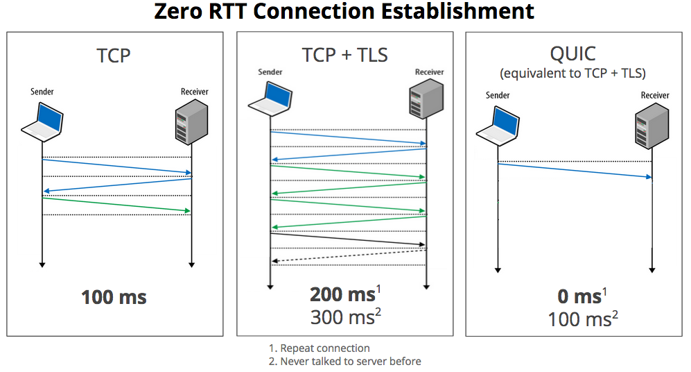

# 8장 웹 프로토콜 최적화

HTTP는 각 버전별 특징이 있으며 상위 버전일수록 더욱 최적화된 기술을 포함하고 있다.

## 8.1 HTTP의 발전

- **HTTP/0.9**
  - GET 메서드만 존재하고 HTML 텍스트 정보만 읽을 수 있다.
  - 클라이언트의 정보를 서버에 전달할 방법이 없다.
- **HTTP/1.0**
  - HTTP 페이로드 외에도 헤더를 통해 서버에 정보를 전달할 수 있다.
  - Content-Type 헤더를 이용해 HTML, 이미지, 동영상 등 다양한 정보를 주고 받을 수 있다.
  - POST 메서드를 통해 클라이언트의 정보를 서버에 전달할 수 있다.
  - Content-Encoding 헤더를 이용해 서버는 압축해 클라이언트에 전달하고, 클라이언트는 다운로드 후 압축을 해제해 브라우징한다.

### 8.1.1 HTTP/1.1

- GET, POST 뿐만 아니라 PUT과 DELETE를 이용해 파일을 업로드 하거나 서버의 내용을 삭제할 방법을 제공한다.
- Via 헤더를 사용해 중계 서버 정보를 공유한다.
- Accept 헤더로 클라이언트의 컨텐츠 지원 형식을 미리 알려줄 수 있다.
- 하나의 TCP 연결을 재사용해 콘텐츠를 전달하는 지속적 연결 기술이 추가되었다.
- 파이프라이닝을 제공한다.
  - 브라우저가 여러 개의 콘텐츠를 요청했을 때 이전 요청의 응답을 받지 않더라도 TCP 연결 내에서 다음 요청에 대한 처리를 시작해 시간을 줄이는 방식이다.

#### 문제점

- HOL(Head-Of-Line blocking): 하나의 요청에 서버가 응답을 지연하면 나머지 모든 요청이 지연된다.
- HTTP/2와 3은 각각 자체적인 HOL 극복 기술을 지원한다.
- [출처](https://withbundo.blogspot.com/2021/02/httphol-head-of-line-blocking.html?m=1)

### 8.1.2 HTTP/2

- 텍스트 방식의 프로토콜 메시지를 버리고 이진 포맷을 사용해 프로토콜 자체 경량화를 시도했다.
  - 1.1의 텍스트 방식 헤더/페이로드가 2부터는 이진 형태의 프레임으로 추상화되었다.
- 새로운 프로토콜 최적화 기능이 추가되었다.
  - 멀티플렉싱, 스트림 우선순위 결정, 헤더 압축, 서버 푸시
- HTTP의 HOL 문제를 해결했지만, TCP의 HOL 문제는 해결하지 못했다.

### 8.1.3 HTTP/3

- 새로운 프로토콜인 QUIC 프로토콜을 사용한다.
  - UDP를 사용해 TCP의 단점을 극복했다.
- 한번 맺은 QUIC 연결을 최대한 재사용하는 구조로 클라이언트와 서버 간 연결 과정 소모 시간을 대폭 줄였다.

 

## 8.2 HTTP/2의 최적화 기술

HTTP/2의 가장 큰 목표는 다음과 같다.

- 클라이언트와 서버가 콘텐츠를 주고 받는 시간을 줄인다.
- 서버 응답이 노린 콘텐츠가 다른 콘텐츠의 전달을 방해하지 않도록 한다.

HTTP/2는 다음과 같은 프로토콜 최적화 기술을 통해 목표를 달성했다.

### 8.2.1 HTTP/2의 이진 프레임

- 3개의 단위가 추가되었다.
  - 프레임: HTTP/2 통신상 제일 작은 정보 단위이며 헤더나 데이터 중 하나다.
  - 메시지: HTTP/1.1 마찬가지로 요청 혹은 응답 단위이며 다수의 프레임으로 이루어져 있다.
  - 스트림: 클라이언트와 서버 사이 맺어진 연결을 통해 양방향으로 주고 받는 하나 혹은 복수의 메시지다.
  - 프레임이 모여 메시지, 메시지가 모여 스트림이 되는 구조다.
- 스트림을 통해 요청과 응답이 하나의 단위로 묶일 수 있는 구조가 만들어졋다.
- 클라이언트는 응답 스트림의 번호를 통해 어떤 요청에 대한 응답인지 구분한다.

스트림의 상세 구조는 다음과 같다.

- 큰 데이터는 여러개의 프레임에 나누어 전달할 수 있다.
- 스트림 방식을 사용해 1.1 버전보다 요청/응답할 수 있는 오브젝트의 개수가 많아졌다.
- 한 번에 많은 콘텐츠를 저달하는 포털, 쇼핑몰 등은 HTTP/2를 사용하면 로딩 속도가 빨라질 수 있다.

### 8.2.2 멀티플렉싱

- HTTP/1.1의 파이프라이닝 기능을 개선한 것이다.
  - 파이프라이닝의 선입 선출 방식은 콘텐츠들이 대기 상태로 있어야하는 단점이 있었다.
- 하나의 TCP 연결상에서 다수의 클라이언트 요청과 서버의 응답이 비동기 방식으로 이루어지는 기술이다.
  - 이를 통해 1.1의 HOL 문제가 해결되었다.
- 크기가 크거나 처리가 오래 거리는 콘텐츠를 전달할 때 병목 현상을 피할 수 있게 되었다.

### 8.2.3 헤더 압축

- HTTP/1.1에서는 페이로드를 서버에서 압축했다. 그러나 헤더는 압축이 불가했다.
- HTTP/2는 클라이언트와 서버 사이의 가상의 테이블을 만들어 중복 전달을 제거했다.
  - 정적 테이블: 미리 정의된 자주 사용되는 헤더 필드를 저장한다.
  - 동적 테이블: 클라이언트와 서버가 통신하며 주고받는 값들을 업데이트한다.

### 서버 푸시

- 클라이언트가 특정 컨텐츠를 요청하면 서버는 이후 추가될 다음 요청을 미리 예상하고 요청없이도 응답하는 기능이다.
- 로딩 완료 시간을 크게 줄일 수 있다.
- 서버 푸시 대상은 관리자/개발자가 미리 정할 수 있다.

 

## 8.3 HTTP/3의 최적화 기술

### 8.3.1 QUIC

- UDP를 채택해 TCP의 성능을 개선하려는 기술이다.
- 전달 속도를 향상한다.
- 클라이언트와 서버간 연결 수를 최소화한다.
- 대역폭을 예상해 패킷 혼잡을 피한다.
- Zero RTT: 클라이언트가 한 번이라고 접속했던 서버라면 별도의 정보 교환 없이 바로 데이터를 보내는 기술이다.

## 8.3.2 HTTP/3의 등장 배경

- HTTP/2의 HPACK, 서버푸시 등은 성공했지만 TCP 프로토콜 자체의 HOL을 완벽하게 해결하지는 못했다.
- 새로운 기능을 추가하기 보다 QUIC라는 UDP 기반의 프로토콜을 사용해 TCP가 가지고 있는 HTTP/2의 단점을 보완하는데 중점을 두었다.

### 8.3.3 HTTP/3의 특징

- TCP/IP 기반 애플리케이션 레이어 프로토콜 HTTP를 QUIC 위로 위치시켰다.
  - 이를 HQ(HTTP over QUIC)라고 한다.
- TCP HOL의 문제만 개선한 것이 아니라 HTTP/2의 모든 기능을 계승해 UCP의 빠른 성능, QUIC의 효율성, TLS 1.3의 보안성까지 모든 장점을 갖는다.
