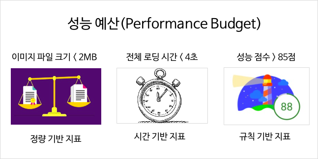

# 웹 성능이란 무엇인가?

## 1.1 웹
- 인터넷에 연결된 컴퓨터를 통해 수많은 정보를 공유할 수 있는 인터넷의 대표적인 서비스
  - ex) 인터넷 서비스의 종류: 이메일, 메신저, 텔넷, FTP 등

### 1.1.1 웹의 역사

- 물리학자들 간 공동으로 연구를 진행하고 그 결과를 빠르게 공유하기 위해 팀 버너스 리 등이 개발

- 웹 등장 이전
  - TCP/IP 혹은 UDP를 이용한 클라이언트-서버 간 네트워크 통신 또는 소켓 네트워크 기술을 사용해 데이터를 교환할 수 있었다.
- 웹의 등장
  - 웹 사이트라는 페이지를 기반으로 문자 뿐만 아니라 다양한 정보를 문서 읽듯 제공하고,
    이를 읽을 수 있는 전용 프로그램인 브라우저를 일종의 데이터베이스로 사용해 필요한 정보를 조회하고 전달할 수 있는 방법 고안

> 웹: 인터넷 상에서 하이퍼텍스트를 바탕으로 관련있는 문서끼리 연결한 집합체
>> 하이퍼텍스트: 참조를 통해 한 문서에서 다른 문서로 접근할 수 있는 텍스트 하이퍼텍스트 문서에는 단순 텍스트 뿐만 아니라 다양한 컨텐츠 형식을 담을 수 있다.

### 1.1.2 웹의 대표적인 요소

- URL(Uniform Resource Location)
  - 웹 자원이 인터넷상 어느 위치(Location)에 존재하는지 알려주는 방법
  - 자원의 식별자(Identifier)인 URI의 한 종류
  - URL은 프로토콜, 도메인, 자원의 경로 등으로 이루어진다.
- 네트워크 프로토콜
  - 주로 HTTP(HTTPS)를 사용
  - 구성요소
    - Header: 클라이언트(브라우저)와 서버 사이에 필요한 정보
    - payload(or body): 실제 데이터 정보
- HTML(HyperText Mark-up Language)
  - Tag를 사용해 다양한 컨텐츠를 브라우저에 보여주는 언어
  - 페이지 문서의 단락 등 구조를 표현하기도 한다.
  - 일반적으로 서버는 HTML문서를 브라우저에게 전달한다.
  - 그외 JavaScript, CSS

## 1.2 웹 성능이 중요한 이유

- 웹 성능은 사용자에게 웹 컨텐츠나 서비스를 얼마나 빠르게 전달하는지에 대한 성능을 의미
- 웹 로딩 시간과 관련이 깊다.
- 웹 로딩 시간은 실제 사용자들의 이탈률, 서비스 이용률 등에 영향을 준다.
- 직접적으로 매출에 영향을 주지 않아도 '느린 사이트'라는 인식은 좋지 못한 선입견을 갖게한다.
- 3초의 법칙: 3초 안에 웹 사이트에 접속한 사용자의 관심을 끌어야한다
  - 웹 사이트의 로딩이 빨라야 한다.
  - 웹 사이트의 머리말(heading)이 주목받을 수 있어야 한다.
  - 웹 페이지의 글이 눈에 띄어야 한다.
  - 웹 페이지 내 사용자 행동이 필요한 부분은 명확히 전달해야 한다.
- 글로벌 서비스의 경우 느린 네트워크 환경을 고려한 웹 성능 최적화(Web Performance Optimization, WPO)를 고민해야한다.

## 1.3 웹 성능 측정 방법

- 웹 성능을 측정하려면 성능에 영향을 주는 요소를 파악하고 성능을 측정할 수 있는 도구를 선택해야한다
  - 사용자 입장: 거주지역, 네트워크 장비(4G, 5G, Wi-fi 등), 브라우저 등
  - 공급자 입장: DNS 네임 서버 응답 속도, 웹 서버 응답 속도, 웹 사이트의 백엔드 처리 속도, 프런트엔드 최적화 여부
  - 전달 환경: 웹 서버가 위치한 데이터 센터가 자체 전용선을 보유했는지, 유선망과 모바일망에 각각의 서버를 배포했는지

### 1.3.1 크롬 브라우저의 개발자 도구
- 네트워크 탭에서 DOMContentLoaded 시간, Load 시간 등과 각 리소스의 waterfall 등을 확인할 수 있다.

### 1.3.2 WebPageTest 서비스

https://www.webpagetest.org

- 세계 여러 위치에서 로딩 속도를 테스트할 수 있는 서비스
- 실제 유선망, 모바일 망의 네트워크, 다양한 기기, 브라우저를 곳곳에 설치하여 실제 사용자 환경에서의 테스트를 제공
- 웹 성능에 영향을 주는 6개 항목을 점수(A ~ F)로 알려줌
  - First Byte Time: 웹 서버에서 받은 콘텐츠의 첫 번째 바이트가 얼마 만에 도착했는가?
  - Keep-Alive Enabled: TCP 연결을 재사용하기 위한 Keep-Alive가 설정되어 있었는가?
  - Compress Transfer: 스크립트 파일이 Content-Encoding으로 압축되어 있었는가?
  - Compress Image: 이미지를 압축해 최적화했는가?
  - Cache Static content: 정적 파일에 브라우저 캐시가 설정되어 있었는가?
  - Effective use of CDN: CDN을 효과적으로 적용했는가?

### 1.3.3 구글 PageSpeed

https://pagespeed.web.dev

- 웹 사이트 성능 개선을 돕기 위해 구글에서 개발한 서비스.
- 모듈 Mod_pagespeed: Apache나 Nginx 웹 서버에 추가할수 있는 오픈소스 모듈.
  - 웹 서버에 연동하여 CSS, JavaScript, HTML, 이미지 등의 성능 최적화를 수행함.
  - 장점: 원본 콘텐츠를 별도로 가공하여 저장할 필요없이 최적화된 모듈을 웹상에서 클라이언트에게 실시간으로 제공함. 설치 이후 자동으로 최적화 실행
- 모듈 PSI(PageSpeed Insights): 웹 사이트의 성능 최적화 요소를 평가하는 서비스를 제공.
  - PC와 모바일 환경의 웹 성능 테스트 결과를 심플하게 제공.

## 1.4 웹 성능을 만드는 지표

- 스티브 사우더스의 14가지 웹 성능 최적화 기법
- 백엔드
  1. Expires 헤더를 추가한다.
  2. gzip으로 압축한다.
  3. 페이지 재전송(redirection)을 피한다.
  4. ETag를 설정한다.
  5. 캐시를 지원하는 AJAX를 만든다.
- 프론트엔드
  1. HTTP 요청을 줄인다.
  2. 스타일 시트는 상단에 넣는다.
  3. 스크립트는 하단에 넣는다.
  4. CSS표현식은 피한다.
  5. 자바스크립트와 CSS는 외부 파일에 넣는다.
  6. 자바스크립트는 작게 한다.
  7. 중복 스크립트는 제거한다.
- 네트워크
  1. CDN을 사용한다.
  2. DNS 조회를 줄인다.

### 1.4.1 사용자 환경 -프런트엔드
- 성능은 빠르고 보기 쉽게 컨텐츠를 전달하는 것이 프런트엔드의 가장 큰 목적

### 1.4.2 공급자 환경 -백엔드
- 실제로 컨텐츠를 생산하고 저장하며 전달하는 일들에 대한 성능
- 백엔드 서비스 자체 성능 뿐만 아니라 데이터베이스, 라우터, 네트워크 스위치 성능도 포함한다.

### 1.4.3 전달 환경 -네트워크
- 전달환경의 성능은 대역폭(bandwidth)과 지연시간(latency)에 영향을 받는다.
  - 대역폭(bandwidth): 일정 시간에 처리할 수 있는 트래픽 양
  - 지연시간(latency): 기술적 이유로 사용자에게 컨텐츠를 전달하지 못하고 지연되는 시간
- ISP(Internet Service Provider)가 제공하는 품질에 의존

## 1.5 웹 성능과 프런트엔드

- 프런트엔드가 페이지 로딩 시간 중 대부분을 차지
  - 이유: 사용자 관점에서 원하는 콘텐츠를 전달받았는지가 웹 성능의 기준이기 때문.
  - 콘텐츠를 생산하는 시간 < 콘텐츠를 렌더링하는 시간

### 1.5.1 브라우저 렌더링

- 브라우저 렌더링 시 성능 지표
  - FCP(First Contentful Paint): 첫 번째 텍스트 또는 이미시가 표시되는 데 걸린 시간
  - SI(Speed Index): 페이지 컨텐츠가 얼마나 빨리 표시되는지 (참고)
  - LCP(Largest Contentful Paint): 가장 큰 텍스트 또는 이미지가 표시된 시간
  - TTI(Time to Interactive): 사용자와 페이지가 상호작용할 수 있게 된 시간
  - TBT(Total Blocking Time): FCP와 TTI사이 모든 시간의 합
  - CLS(Cumulative Layout Shift): 표시영역 안에 보이는 요소들이 얼마나 이동하는지에 대한 정보

## 1.6 웹 성능 예산

- 성능 예산: 웹 성능에 영향을 미치는 다양한 요소를 제어하는 한곗값을 의미

### 1.6.1 정량 기반 지표
- 이미지, 스크립트, 폰트 등 웹 페이지 제작에 필요한 요소들에 대한 한곗값
  - 이미지 파일의 최대 크기
  - 최대 웹 폰트 파일 개수
  - 자바스크립트 파일 크기 합
  - 타사 스크립트 개수 합

### 1.6.2 시간 기반 지표

- DOMContentLoaded, Load와 같이 브라우저에서 실제로 발생하는 다양한 웹 성능 이벤트 값을 측정하여 사용주가 느끼는 웹 성능에 대한 목표치를 설정하는 방식
- 대표적인 시간 기반 지표
  - FCP(First Contentful Paint): 텍스트 또는 이미지와 같이 DOM의 첫 번째 비트를 표시하는 시점
  - TTI(Time to Interactive): 페이지가 사용자 입력에 안정적으로 응답하는 데 걸리는 시간

### 1.6.3 규칙 기반 지표
- 규칙 기반 지표 예시
  - WebPageTest의 성능 점수
  - 구글 Lighthouse의 성능 점수
- 점수를 통해 유사 사이트와 비교할 수도 있고, 어느 부분을 개선 포인트로 삼아야하는지도 발견할 수 있다.
- 사내에 자체적인 웹 성능 지표에 대한 테스트케이스를 만들고, 자동화 테스트 시스템을 통해 웹 사이트의 성능을 지표화하는 방식을 이용하기도 한다.
- 정량 기반 지표와 시간 기반 지표를 개선할수록 규칙 기반 지표 점수는 높아진다.
