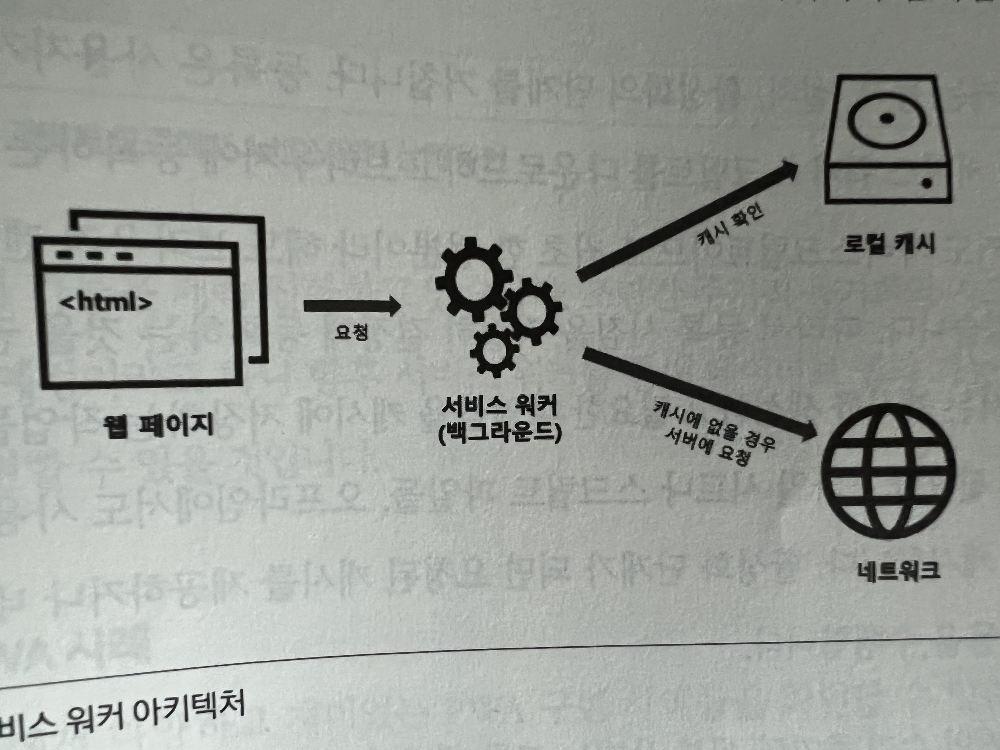

# 웹 최적화 트렌드

## 9.3 PWA

- 모바일 네이티브 앱
  - 장점
    - 인터넷에 연결되지 않아도 앱이 구동할 수 있다.
    - 운영 체제와 잘 통합되어 매끄러운 사용자 경험
    - 백그라운드에서 관심 있는 정보나 푸시 알림을 보내줄 수 있다.
  - 단점
    - 앱 스토어에서 검색하고 다운로드해야 한다.
    - 배포와 설치가 오래걸리고 번거롭다.
  
- 모바일 웹
  - 장점
    - URL만 클릭하면 웹 사이트에 접속할 수 있어 설치하는 것보다 빠르고 쉽게 접근할 수 있다.
  - 단점
    - 운영 체제의 기능들을 활용하는데 있어 제한이 있다.
    - 인터넷이 연결되어 있지 않은 환경에서 사용하기 어려운 경우가 많다.
    
- `PWA`
  - 네이티브 앱과 모바일 웹의 장점을 모두 갖추도록 특정 기술과 표준 패턴을 사용해 개발한 웹앱.
  - 브라우저를 통해 구동되므로 사용자가 접근하기에 유용하다.
  - 별도로 설치하지 않아도 사용할 수 있다.
  - 오프라인에서 동작할 수 있다.
  - 필요한 경우 푸시 알림을 통해 주요 정보를 능동적으로 전달할 수 있다.
  - 모바일 앱과 동일하게 홈 화면에 앱 아이콘을 추가할 수 있다.
  - **PWA의 핵심 특징**
    1. 모든 형태의 화면에 반응해야 한다.
    2. 네트워크 독립적이어야 한다.
    3. 앱과 같은 상호 작용 기능이 있어야 한다.
    4. 항상 최신 내용으로 업데이트 되어 있어야 한다.
    5. HTTPS를 사용해 암호화된 데이터를 전송해야 한다.
    6. 웹의 검색 엔진에서 쉽게 찾을 수 있어야 한다.
    7. 재참여할 수 있어야 한다.
    8. 설치할 수 있어야 한다.
    9. 쉽게 연결할 수 있어야 한다.
  - **PWA의 이점** 
    1. 서비스 워커를 사용한 캐시로 앱 로딩 시간을 줄이고 경제적으로 사용할 수 있다.
    2. 앱 업데이트 시 변경된 컨텐츠만 업데이트할 수 있어 매우 효율적이다.
    3. 반응형으로 동작하므로 다양항 플랫폼들 위에서 통합된 형태를 전달할 수 있다.
    4. 시스템 알림 및 푸시 메시지를 통해 사용자의 재참여를 이끌어낼 수 있다.

### 9.2.1 PWA 주요 기술

#### App Shell 
- PWA는 크게 App Shell과 컨텐츠로 구성된 아키텍처다.
- 앱이 동작하는데 필요한 정적 파일들로 구성되며 HTML, CSS, JS, 이미지 등이 포함된다.
- 최소한의 사용자 인터페이스를 로딩하는 것에 중점을 두고 있으며, 이를 캐싱하여 다음 방문시 앱의 모든 컨텐츠가 로딩되기 전에 오프라인에서도 사용이 가능하다.
  - 네트워크 문제가 생길 시 컨텐츠가 로딩되지 않아도 캐시된 정적 파일들을 활용해 참여를 유도할 수 있다.
- 서비스 워커가 정적 리소스들을 캐시할 수 있지만 결국 리소스들을 다운로드 해야하므로 파일 크기 줄이기, 네트워크 요청 수 최소화, 렌더링 가속화 등 최적화는 여전히 고려되어야 한다.

#### 애플리케이션 매니페스트 파일
- 앱의 정보를 담고 있는 JSON 기반 파일.
- 홈 화면에 아이콘을 설치하거나 앱이 로딩될 때 첫 페이지, 표시 방향 등의 구동 정보를 설정한다.
```json
{
  "name": "App Sample",
  "description": "This is a sample app",
  "icons": [
    {
      "src": "favicon.ico",
      "type": "image/x-icon",
      "sizes": "64x64 32x32 24x24 16x16"
    },
    {
      "src": "logo192.png",
      "type": "image/png",
      "sizes": "192x192"
    },
    {
      "src": "logo512.png",
      "type": "image/png",
      "sizes": "512x512"
    }
  ],
  "start_url": ".",
  "display": "standalone",
  "theme_color": "#000000",
  "background_color": "#ffffff"
}
```

#### 서비스 워커
- 오프라인에서 PWA를 구동할 수 있는 자바스크립트 형태의 핵심 기술.
- 브라우저와 독립적으로 백그라운드에 실행되며 다양한 요청들을 비동기적으로 처리한다.
- 브라우저와 네트워크 사이 프록시처럼 동작하며 리소스를 캐시하거나 필요에 따라 푸시 메시지를 전달할 수 있다.
- 백그라운드 동기화 기능을 통해 메시지가 네트워크 문제로 정상 전달되지 못했을 때 로컬 저장소에 저장해둔 뒤 네트워크가 원활해지면 백그라운드에서 전송을 완료할 수 있다.
- 웹 워커들의 공통 특성으로 DOM에 직접 에세스 할 수 없다.
- 단계
  - 등록: 사용자가 웹 앱을 최초 방문 시 서비스 워커 스크립트를 다운로드하고 브라우저에 등록.
  - 설치: 캐시를 생성하고 필요한 파일들을 캐시에 저장하는 작업들이 수행.
  - 활성화: 요청된 캐시를 제공하거나 네트워크 프록시 역할 등을 수행.

